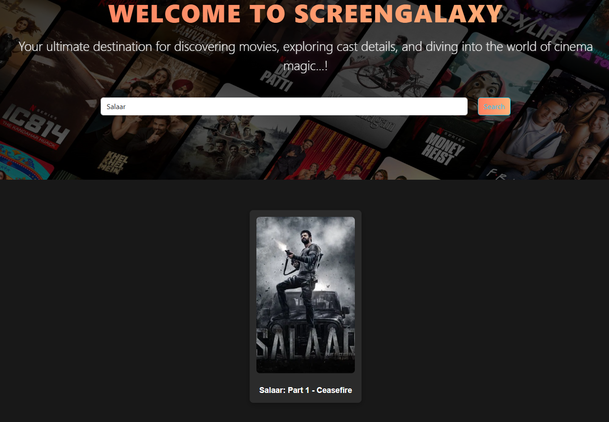
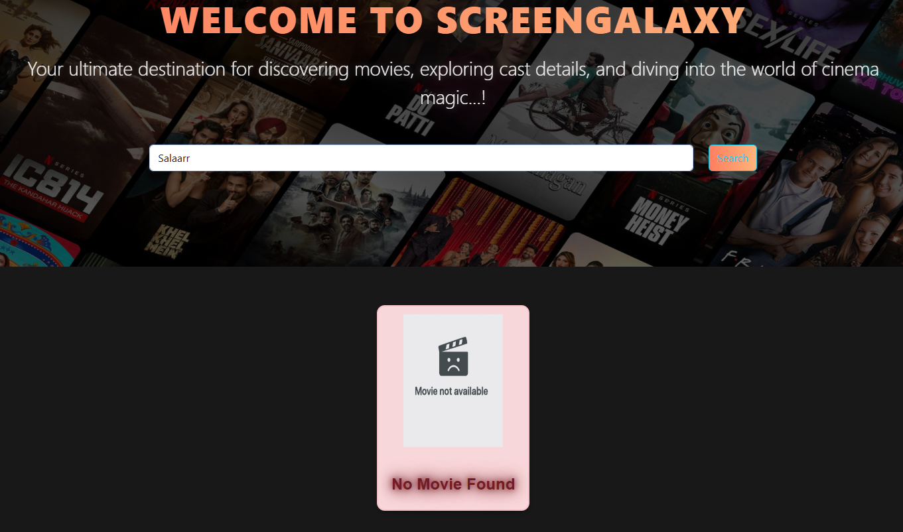
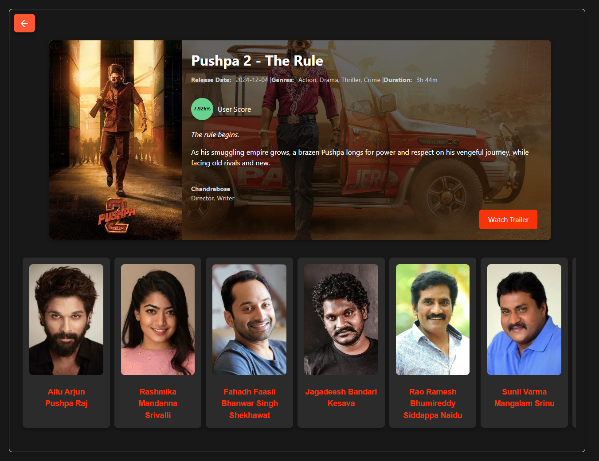
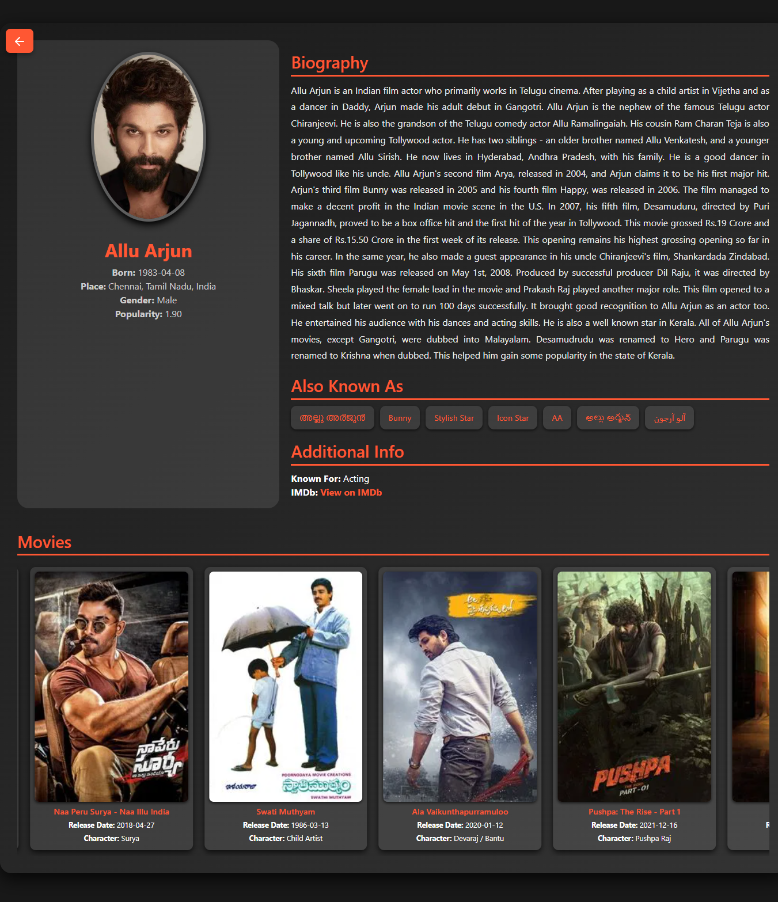
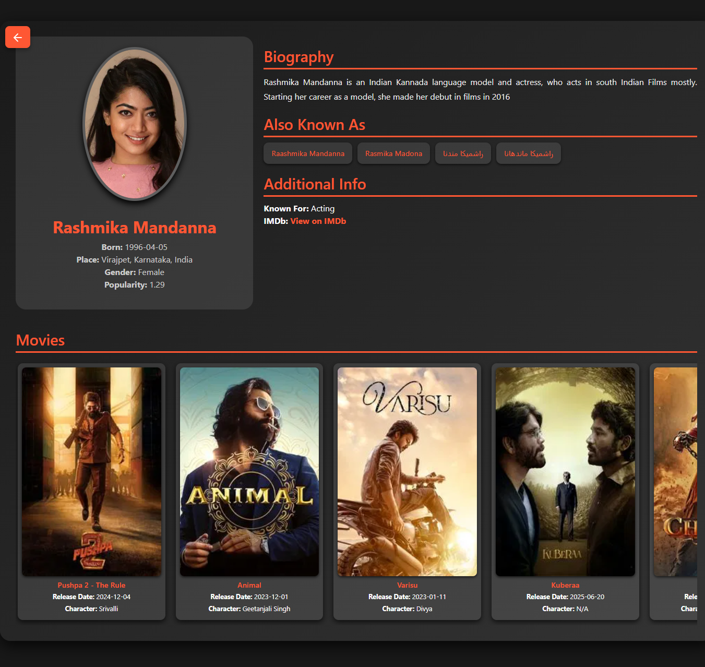

# ScreenGalaxy

ScreenGalaxy is a movie search platform built with React and Vite. It allows users to search for movies, view detailed information about each movie, and explore comprehensive details about cast members, including their biographies and filmographies.

## Features

- **Search Movies:** Quickly find any movie by its name.
- **Movie Details:** Explore detailed information about movies, including genres, release dates, and more.
- **Cast Information:** View full biographies of cast members and a list of movies they've worked in.
- **Responsive Design:** Fully optimized for all devices.

---

## Technologies Used

- **React.js:** For building the user interface.
- **Vite:** For fast builds and HMR (Hot Module Replacement).
- **CSS:** For styling the application.
- **Axios:** For fetching data from APIs.
- **TMDb API:** For accessing movie and cast details.
- **React Router:** For navigation between pages.

---

## How to Run the Project

Follow these steps to run the project locally:

### 1. Clone the Repository

```bash
git clone https://github.com/pareshbavaliya21/ScreenGalaxy.git
```

### 2. Navigate to the Project Directory

```bash
cd ScreenGalaxy
```

### 3. Install Dependencies

Make sure you have Node.js installed, then run:

```bash
npm install
```

### 4. Start the Development Server

```bash
npm run dev
```

The application will be available at `http://localhost:5173`.

---

## Scripts

Here are the available scripts:

- `npm run dev`: Start the development server.
- `npm run build`: Create a production build.
- `npm run preview`: Preview the production build locally.

---

## API Configuration

This project uses the TMDb API for fetching movie and cast details. To use the API:

1. Sign up for a free API key at [TMDb](https://www.themoviedb.org/).
2. Create a `.env` file in the root directory and add your API key:
   ```env
   VITE_API_KEY=your_api_key_here
   ```
3. Restart the development server.

---

## Folder Structure

```
ScreenGalaxy/
├── node_modules/          # Dependencies
├── public/                # Public assets
│   ├── ErrorPage.png      # Error page image
│   ├── Home.jpg           # Home page preview
│   ├── Logo.png           # Application logo
│   ├── main.jpg           # Additional image
│   └── vite.svg           # Vite logo
├── src/                   # Source code
│   ├── assets/            # Assets like icons and images
│   │   └── react.svg      # React icon
│   ├── Components/        # Reusable React components
│   └── store/             # State management files
├── App.jsx                # Main app component
├── index.css              # Global styles
├── main.jsx               # Application entry point
├── .eslintrc.cjs          # ESLint configuration
├── .gitignore             # Git ignore file
├── index.html             # HTML template
├── package-lock.json      # Lock file for npm dependencies
├── package.json           # Project configuration
├── README.md              # Project documentation
└── vite.config.js         # Vite configuration
```

---

## Contributing

Contributions are welcome! Feel free to fork the repository and submit a pull request.

---

## License

This project is open-source and available under the MIT License.

---

Happy Coding! 🎬

## Screen Layout

## 1.Home Page


## 2.User Enter Correct Movise Name



## 3.User Enter InCorrect Movise Name



## 4.Movise Overview



## 5.Male Character Details



## 6.Female Character Details


